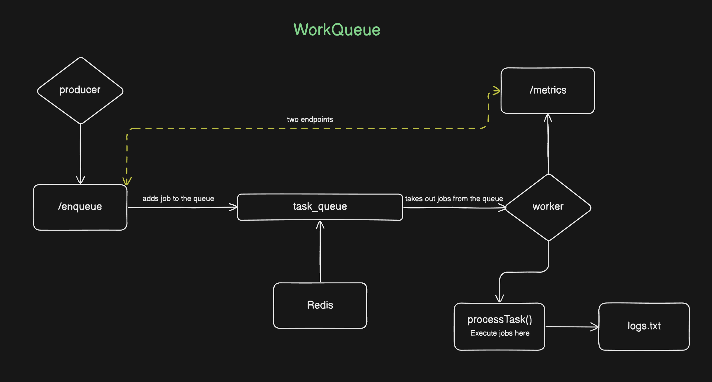

# WorkQueue

A distributed background task processing system built with **Node.js and Redis** that allows applications to offload slow or asynchronous operations to background workers.




# The Problem

Modern web applications often need to perform tasks that take significantly longer than a normal HTTP request should.

Examples include:

* Sending emails
* Generating PDFs
* Processing images
* Calling third‑party APIs
* Running analytics jobs

If these tasks are executed **inside the main request–response cycle**, the API becomes slow and unresponsive.

Example scenario:

User signs up on a website.

Without a background job system:

1. API receives request
2. API sends email
3. Email provider responds
4. API returns response

Total latency: **3–5 seconds**

This leads to:

* Slow user experience
* Blocked server threads
* Poor scalability


# The Solution

WorkQueue solves this problem by introducing a **background job processing system**.

Instead of executing long‑running tasks during the request, the application **adds a job to a queue** and returns immediately.

A separate worker service later processes the job.

Flow:

Client Request → Producer → Redis Queue → Worker → Task Execution

Benefits:

* Fast API responses
* Improved scalability
* Fault‑tolerant background processing
* Easy horizontal scaling


# System Architecture

The system is composed of three main components:

## 1. Producer (API Service)

Responsibilities:

* Accept background jobs via HTTP
* Validate job input
* Push tasks into Redis

The Producer **never executes tasks itself**.

Endpoint:

POST http://localhost:5000/enqueue


## 2. Redis Queue

Redis acts as the **message broker**.

Responsibilities:

* Store pending jobs
* Coordinate workers
* Ensure only one worker processes each job

Workers consume jobs using Redis **blocking list operations (BLPOP)**.

This allows workers to sleep while waiting for tasks without consuming CPU.


## 3. Worker

Workers are responsible for:

* Pulling jobs from Redis
* Executing tasks
* Retrying failed jobs
* Logging outcomes
* Exposing runtime metrics

Workers are **stateless**, which allows the system to scale horizontally by simply starting more worker processes.


# Job Structure

Each job has a flexible schema:

```js
{
  type: String,
  payload: Object,
  retries: Number
}
```

Fields:

| Field   | Description                               |
| ------- | ----------------------------------------- |
| type    | Identifies which task to execute          |
| payload | Arbitrary task-specific data              |
| retries | Number of retry attempts if the job fails |


# Example Job

```json
{
  "type": "send_email",
  "retries": 3,
  "payload": {
    "to": "test@example.com",
    "subject": "Hello"
  }
}
```

# Task Execution

The worker processes tasks using a task handler.

Example:

```javascript
async function processTask(task) {
  switch (task.type) {
    case "send_email":
      console.log("Sending email to", task.payload.to);
      break;

    case "resize_image":
      console.log("Resizing image");
      break;

    case "generate_pdf":
      console.log("Generating PDF");
      break;

    default:
      throw new Error("Unsupported task");
  }
}
```

Adding a new task requires only adding another case.


# Concurrency Model

Workers use Redis blocking operations:

BLPOP queue

This allows workers to efficiently wait for tasks.

Parallelism is achieved by running multiple worker processes:

```
node cmd/worker/main.js
node cmd/worker/main.js
```

Redis distributes jobs among workers automatically.


# Retry Mechanism

If a task fails:

1. Retry count is decreased
2. Job is pushed back to the queue

If retries reach zero:

* Job is marked as failed
* Error is logged

This prevents temporary failures from losing tasks.


# Metrics

Workers expose runtime metrics.

Endpoint:

GET http://localhost:5001/metrics

Example response:

```json
{
  "total_jobs_in_queue": 5,
  "jobs_done": 12,
  "jobs_failed": 2
}
```

These metrics provide visibility into system health.


# Logging

All job executions are logged to `logs.txt`.

Logged information includes:

* Task type
* Payload
* Remaining retries
* Error message (if any)


# Design Principles

* Producer is stateless
* Workers are stateless
* Redis handles coordination
* Tasks define their own retry policy
* Workers share no memory

This design makes the system easy to scale and reason about.


# Installation & Setup

1. Install dependencies:

```bash
npm install
```

2. Environment variables are defined in `.env`:

```env
PORT_PRODUCER=5000
PORT_WORKER=5001
```

# Running the Project

### Step 1: Start Redis

Ensure Redis server is started on default port `6379`:

```bash
redis-server
```
*(or `redis-server $(brew --prefix)/etc/redis.conf`)*

### Step 2: Start Producer

```bash
npm run start:producer
# or: node cmd/producer/main.js
```

### Step 3: Start Worker

```bash
npm run start:worker
# or: node cmd/worker/main.js
```

# Endpoints & Usage

### 1. Enqueue a Task (Producer)

**POST** `http://localhost:5000/enqueue`

```bash
curl -X POST http://localhost:5000/enqueue \
  -H "Content-Type: application/json" \
  -d '{
    "type": "send_email",
    "retries": 3,
    "payload": {
      "to": "test@example.com",
      "subject": "Hello"
    }
  }'
```

### 2. Get Metrics (Worker)

**GET** `http://localhost:5001/metrics`

```bash
curl http://localhost:5001/metrics
```

# What This Project Demonstrates

* Background job queue architecture
* Distributed worker systems
* Redis as a coordination layer
* Retry mechanisms
* Observability with metrics
* Stateless service design

# Summary

WorkQueue is a minimal but realistic background processing system that demonstrates how modern distributed applications handle asynchronous work outside the request–response cycle.

It mirrors the architecture used by production systems such as task queues in large-scale backend services.
